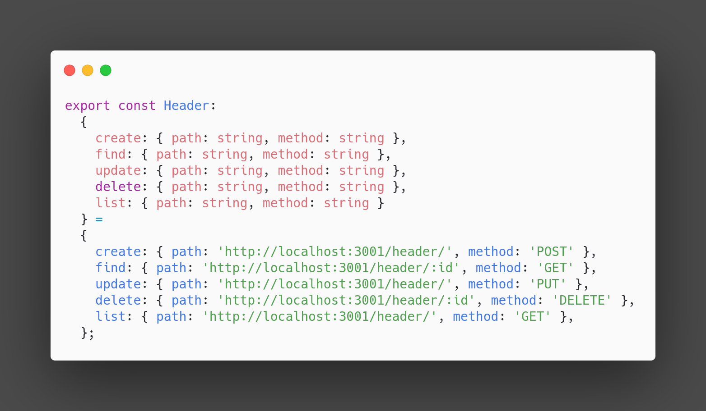
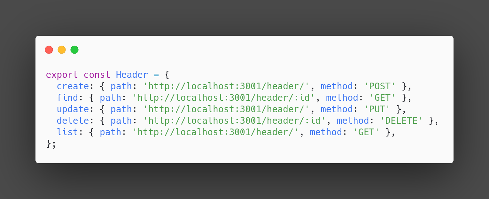

<p align="center">
  <a href="http://nestjs.com/" target="blank"></a>
</p>

<p align="center"><p align="center">
  
  


  <a href="https://paypal.com/paypalme/ucnkleg"></a>
</p>

## Description

Nest route exporter, exports application routes with developer friendly interface for consuming them on FE apps or somewhere else.

## Installation

```bash
$ npm i --save nestjs-route-exporter
```

```bash
$ yarn add nestjs-route-exporter --save
```

## Note!
Before generating routes modify ```tsconfig.json``` file to not watch exported routes directory because
you will end up in recursive compilation:
```javascript
  ...
  
  "include": [
    "./src/**/*"
  ],

  "exclude": ["node_modules", "dist", "routes/**/*"]
```

## Generating typescript routes
```javascript
async function bootstrap() {
  const app = await NestFactory.create<NestExpressApplication>(AppModule);
  
  // Generate typescript routes file
  routeExporter(app, 'http://localhost:3001', './routes', 'index.ts'); // Will generate index.ts in root/routes dir
}

bootstrap();
```

- If you have Header controller in your Nest application output will be generated in root/routes/index.ts file 



## Generating javascript routes
```javascript
async function bootstrap() {
  const app = await NestFactory.create<NestExpressApplication>(AppModule);
  
  // Generate typescript routes file
  routeExporter(app, 'http://localhost:3001', './routes', 'index.js'); // Will generate index.js in root/routes dir
}

bootstrap();
```

- If you have Header controller in your Nest application output will be generated in root/routes/index.js file 



## Support

Nest route exporter is an MIT-licensed open source project. 

## Stay in touch

- Author - [Djordje Stojiljkovic](https://twitter.com/uncklegdev)
- Website - [https://djordjes.com](https://djordjes.com/)
- Twitter - [@uncklegdev](https://twitter.com/uncklegdev)

## License

Nest route exporter is [MIT licensed](LICENSE).